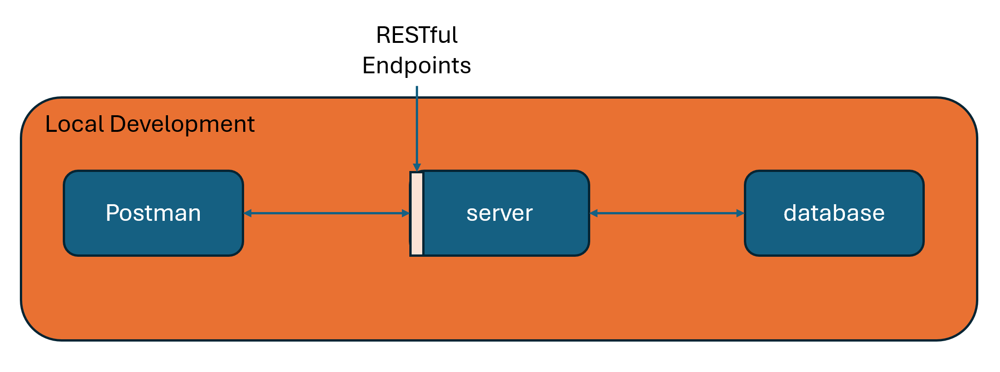
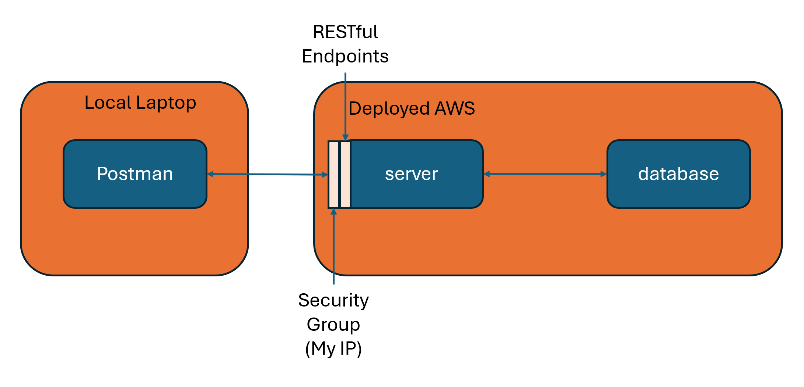

# Project Description and Architecture
These are supporting projects that are architectured. 

## Table of Contents

- [Store Management System](#SMS)
- [Customer Management System](#CMS)
- [AI Sales Management System](#AISMS)

## Store Management System

RESTful endpoints supporting store inventory management system.

Written in Java and Springboot.

Postgres is the database.

<table>
  <tr style="background-color: gray;">
    <th>Verb</th>
    <th>Endpoint</th>
    <th>Description</th>
  </tr>
  <tr>
    <td>GET</td>
    <td>/inventory/products</td>
    <td>Returns JSON data consisting of a list of products with the name, productId, and price. </td>
  </tr>
  <tr>
    <td>POST</td>
    <td>/inventory/bogo</td>
    <td>Input is JSON data consisting of a list of productIds that gets added to the BOGO list. Returns JSON data consisting of current list of BOGOs.</td>
  </tr>
<tr>
    <td>GET</td>
    <td>/inventory/bogos</td>
    <td>Returns JSON data consisting of products listed as BOGO.</td>
  </tr>
<tr>
    <td>DELETE</td>
    <td>/inventory/bogos</td>
    <td>Input is JSON data consisting of deleted productIds from BOGO list. Returns the remaining list of BOGOs.</td>
  </tr>
</table>

## Customer Management System (In Progress)

RESTful endpoints supporting shopping cart management system.

Written in C#.

Postgres is the database.

<table>
  <tr style="background-color: gray;">
    <th>Verb</th>
    <th>Endpoint</th>
    <th>Description</th>
  </tr>
  <tr>
    <td>GET</td>
    <td>/api/Inventory</td>
    <td> </td>
  </tr>
  <tr>
    <td>POST</td>
    <td>/api/ShoppingCart/AddItem</td>
    <td> </td>
  </tr>
<tr>
    <td>DELETE</td>
    <td>/api/ShoppingCart/FromShoppingCart</td>
    <td> </td>
  </tr>
<tr>
    <td>GET</td>
    <td>/api/ShoppingCart</td>
    <td> </td>
  </tr>
<tr>
    <td>POST</td>
    <td>/api/ShoppingCart/Purchase</td>
    <td> </td>
  </tr>
</table>

## AI Sales Management System (future work)

AI driven solution to determine sale prices and BOGO prices of store inventory.

RESTful endpoints supporting when store inventory should go on sale due to calendar date.

Written in Python.
